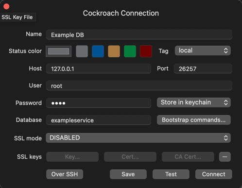
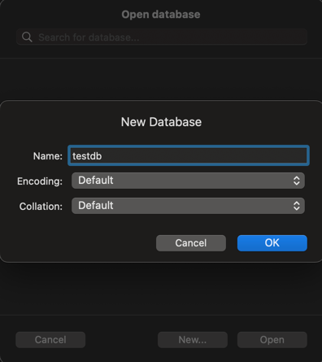

# Web

The web module enables the application to become a web application. When this module is used, a [gin web server](https://github.com/gin-gonic/gin) is started. The web module
allows endpoints and middlewares to be added to the web server using dependency injection. The web module abstracts away the
boilerplate code of running the web server, allowing application code to focus on writing the endpoints.

The web module achieves this by providing the following components:

**NewEngine** - this is a wrapped gin web server. Our wrapper allows the request to be pre-processed before being handled by gin web server.
The only request pre-processor we currently provide is a CachedRequestPreProcessors. This is used during the auth process so that the auth server can
replay the original request after the session is authenticated.

**NewRegistrar** - this registrar is used by other packages to register middlewares, endpoints, error translations etc. This registrar is provided so that
any other feature that wants to add to the web server can do so via the registrar.

The web module also has a ```fx.Invoke```. Because of it, when the web module is activated, it starts the web server and adds all the component in the registrar on it when 
the application starts.

# Web Tests

## Configuring Local Server to Run Web-Tests

In order to test web-tests written for controllers in your service, a local test database needs to be configured before the tests can be executed. In order to do so, follow the steps below:

1. Download [TablePlus](https://tableplus.com/) to connected to the database to run queries.
2. In TablePlus, create a new CockroachDB connection.
3. Navigate to your Golang based service's `config/application.yml` file and locate the following section.
```yaml
.
.
.
data:
  logging:
    level: debug
    slow-threshold: 5s
  cockroach:
    host: ${db.cockroach.host:localhost}
    port: ${db.cockroach.port:26257}
    sslmode: ${db.cockroach.sslmode:disable}
    username: ${spring.datasource.username:root}
    Password: ${spring.datasource.password:root}
    database: exampleservice
 .
 .
 .
 ```
4. Use the fields from `cockroach` section to create the "Cockroach Connection" in TablePlus

5. Once done, create a new database by clicking the database icon or using `⌘+K` on Macs or `Ctrl + K` on Windows and clicking `New...`
6. Name the database to match the name in your implementation
```Go
dbtest.WithDBPlayback("testdb")
```

7. Once done, you're all set to run the controller integration web-tests.
