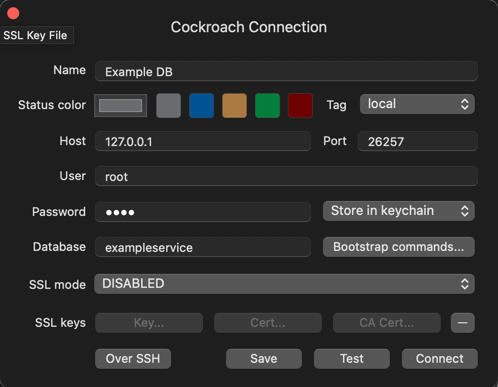
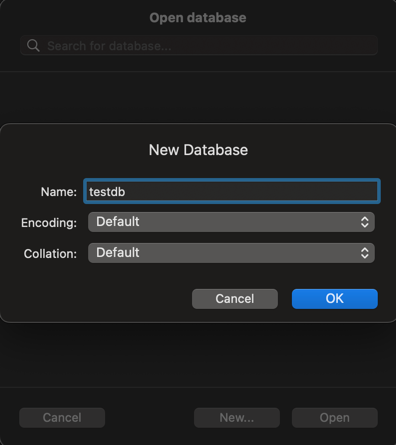

# Database Tests

## Configuring Local Server to Run Database Tests

In order to test web-tests written for controllers in your service, a local test database needs to be configured before the tests can be executed. In order to do so, follow the steps below:

1. Download [TablePlus](https://tableplus.com/) to connected to the database to run queries.
2. In TablePlus, create a new CockroachDB connection.
3. Navigate to your Golang based service's `config/application.yml` file and locate the following section.
```yaml
.
.
.
data:
  logging:
    level: debug
    slow-threshold: 5s
  cockroach:
    host: ${db.cockroach.host:localhost}
    port: ${db.cockroach.port:26257}
    sslmode: ${db.cockroach.sslmode:disable}
    username: ${spring.datasource.username:root}
    Password: ${spring.datasource.password:root}
    database: exampleservice
 .
 .
 .
 ```
4. Use the fields from `cockroach` section to create the "Cockroach Connection" in TablePlus
   
5. Once done, create a new database by clicking the database icon or using `⌘+K` on Macs or `Ctrl + K` on Windows and clicking `New...`
6. Name the database to match the name in your implementation
```Go
dbtest.WithDBPlayback("testdb")
```

7. Once done, you're all set to run the controller integration web-tests.